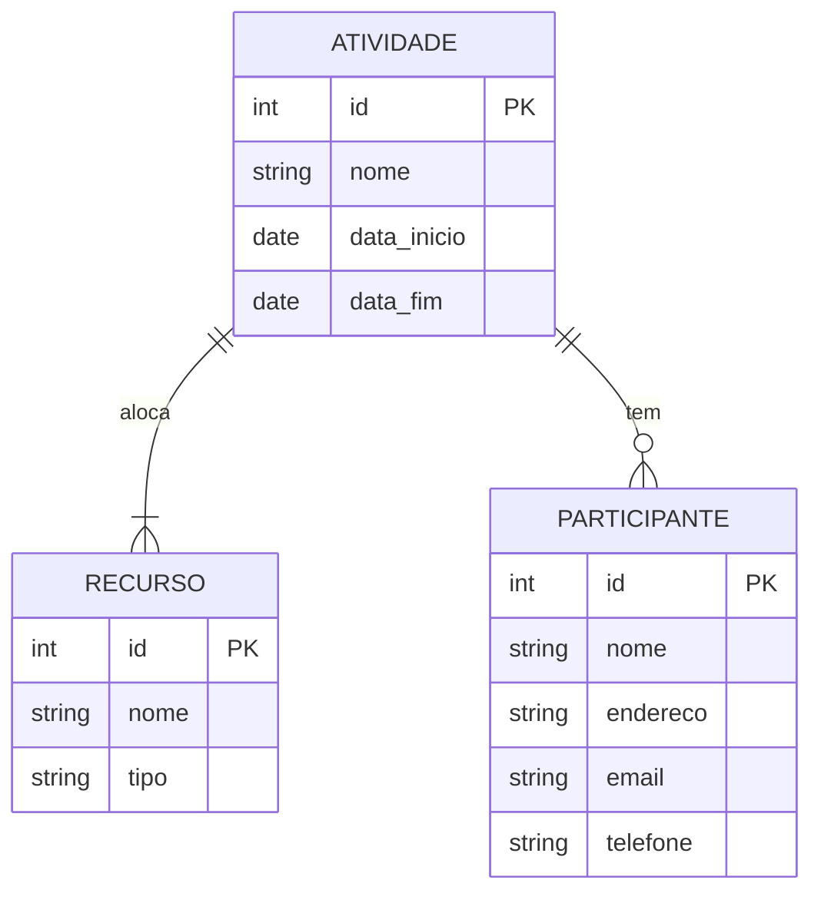
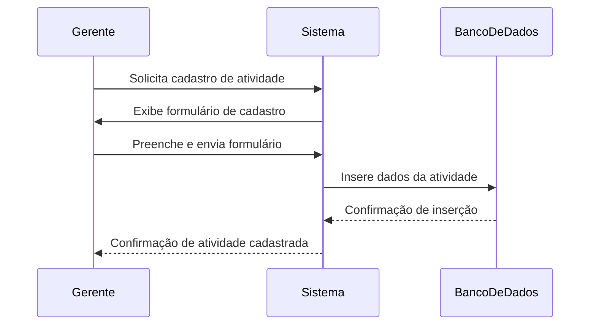

# Sistema de Gestão de Atividades Comunitárias

## 1. Levantamento de Requisitos

### 1.1 Requisitos Funcionais

- **Cadastro de Atividades**
    - Nome da atividade (2-100 caracteres).
    - Recursos alocados (se houver).
    - Data de início e fim.
    - Participantes pré-cadastrados.

- **Cadastro de Recursos**
    - Nome do recurso (2-100 caracteres).
    - Tipo do recurso.

- **Cadastro de Participantes**
    - Nome do participante (2-100 caracteres).
    - Endereço (CEP, Rua, Bairro).
    - E-mail e número de celular.

- **Regras e Funcionalidades**
    - Um gerente pode cadastrar várias atividades.
    - Um participante pode se cadastrar em uma atividade.
    - Uma atividade pode ter um ou vários participantes.
    - Um recurso pode ser alocado em uma ou várias atividades.
    - Acompanhamento da presença dos participantes.
    - Geração de relatórios de atividades.
    - Comunicação via SMS e E-mail.

### 1.2 Requisitos Não Funcionais
- Desempenho: O tempo de resposta para cadastro e consulta de atividades deve ser menor que 2 segundos.
- Escalabilidade: O sistema deve suportar o cadastro e gerenciamento de até 10.000 atividades simultâneas.
- Disponibilidade: O sistema deve estar disponível 99,9% do tempo.
- Segurança: Implementação de autenticação e autorização, com suporte a JWT para sessões seguras.

### 2. Plano de Testes
#### 2.1 Testes de Unidade
- Testar individualmente as funcionalidades de cadastro de atividades, recursos e participantes.
- Verificar a validação de campos, como limite de caracteres e formatos de e-mail/CEP.
#### 2.2 Testes de Integração
- Testar a integração entre o front-end e back-end, especialmente ao submeter formulários.
- Verificar a interação entre o sistema e o banco de dados para garantir que os dados são armazenados corretamente.
#### 2.3 Testes de Aceitação
- Realizar testes com os gestores do Centro Comunitário Abreu e Lima para garantir que o sistema atende às suas expectativas.
- Coletar feedback e fazer os ajustes necessários antes da implantação final.

## 3. Diagramas

### 3.1 Diagrama de Entidade-Relacionamento (ER)

### 3.2 Diagrama de Sequência (Exemplo: Cadastro de Atividade)

